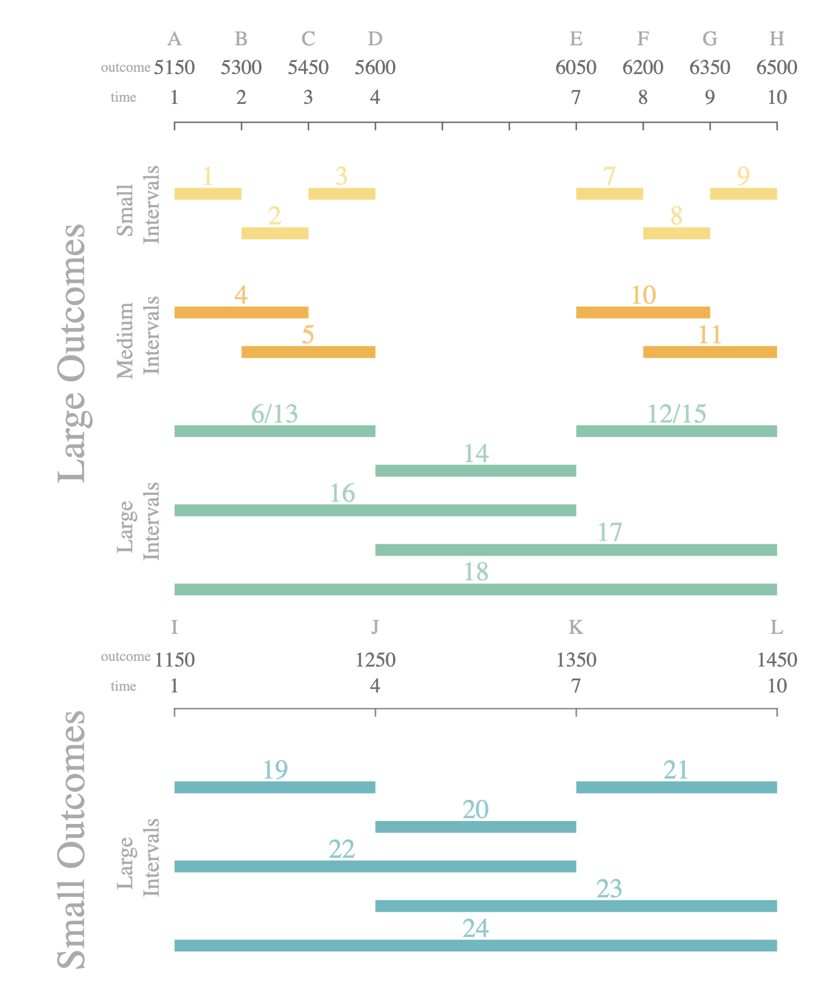

# Testing the integration rule in intertemporal choice models

This repository contains all the necessary files to run and analyze intertemporal choice models used to test the integration rule.

## Repository Structure

### `data/`

This directory contains the experimental data.

- The data are provided as a ZIP file with 25 CSV files, one per participant.
- Each CSV file corresponds to a single participant’s responses and includes the following columns:
	- trial: Trial number
	- money_left: Amount of money offered in the left option
	- weeks_left: Delay (in weeks) associated with the left option
	- money_right: Amount of money offered in the right option
	- weeks_right: Delay (in weeks) associated with the right option
	- choice: Indicates whether the participant chose the left or right option
	- biggerchosen: Binary coding of the choice
		- 1 = larger-later option chosen
		- 0 = smaller-sooner option chosen
	- pair: ID of the question pair (see image below)
	- time: Time taken to answer the question
	- date: Date when the response was recorded

### `r_code/`

This directory contains all R scripts used to estimate the models, including the mixture model.

```
└── r_code
    ├── analysis
    ├── models
    │   ├── m01_hyperboloid.R
    │   ├── m02_tradeoff.R
    │   ├── m03_itch.R
    │   ├── m04_prop_diferences.R
    │   ├── m05_dir_diferences.R
    │   └── m06_mixture_model.R
    └── utils
```


- The `models/` folder contains the implementation of each individual model.
- The `analysis/` and `utils/` folders contain supporting scripts for estimation and post-processing.

### `python_code/`

This directory contains the Python implementation and structure needed to run the models in Python.

### `images/`

Contains figures and visual outputs generated from the analyses.

### `notebooks/`

Includes exploratory and testing notebooks, mainly used for experimenting with JAGS in Python.


## Questions IDS



